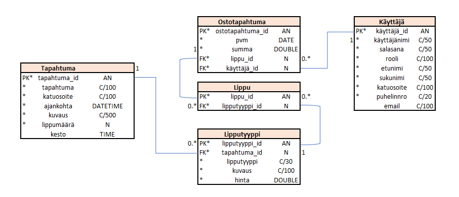

# TicketGuru (alustava nimi)

Tiimi: Heli Kyllinen, Viljami Olsen, Leevi Vehviläinen, Sakari Arasola, Viivi Salin

## Johdanto

-   Järjestelmä tehdään lipputoimistolle, joka myy lippuja lipunmyyntijärjestelmän avulla. Lipunmyyntitoimisto voi tarkastella myyntitapahtumia järjestelmän avulla.
-   Toteutus- ja toimintaympäristö lyhyesti:  
    -   Palvelinpuolen ratkaisut ja teknologiat (esim. palvelinteknologia, mikä tietokantajärjestelmä on käytössä)
- MariaDB / HeidiSQL
    -   Käyttöliittymäratkaisut ja teknologiat:
        - nettisivut 
    
## Järjestelmän määrittely

Määrittelyssä järjestelmää tarkastellaan käyttäjän näkökulmasta. Järjestelmän
toiminnot hahmotellaan käyttötapausten tai käyttäjätarinoiden kautta, ja kuvataan järjestelmän
käyttäjäryhmät.

-   Käyttäjäryhmiä ovat lipunmyyjät, asiakkaat (lipun ostajat), järjestelmän ylläpitäjä, lipunmyyntitoimiston johto
-   Käyttäjätarinat löytyy toisesta dokumentista
-   Lyhyt kuvaus käyttötapauksista tai käyttäjätarinat

Kuvauksissa kannattaa harkita, mikä on toteuttajalle ja asiakkaalle oleellista
tietoa ja keskittyä siihen.

## Käyttöliittymä

- Lipunmyyntisivu:
Tällä sivulla näkyy järjestelmän lippujen ja asiakkaiden tiedot, näiden välisenä siirtyämänä käytetään Ostotapahtuma-taulua.
- Tapahtumasivu:
Tällä sivulla näkyy tapahtumien ja tarkemmat lipputiedot.
- Tapahtumien hallinta: Tapahtumien CRUD-toiminnot (Rest)
- Myyntiraportti
Tällä sivulla näkyy maksutapahtumien tiedot.

## Tietokanta

> ### _Selitykset_
> _Tässä on selitykset tietokannan taulujen tyypeille._
>
>  Tyyppi | Kuvaus
> ------ | ------ 
> PK | Pääavain
> FK |  Viiteavain
> "*" |  Pakollinen tieto
> AN | Autonumber/laskuri
> C/10 | Teksti/pituus
> N| Numero
> DATE | Päivämäärä
> DATETIME | Päivämäärä ja kellonaika
> TIME | kellonaika

> ### _Tapahtuma_
> _Tapahtuma-taulu sisältää tapahtuman tiedot. Jokaiselle tapahtumalle tehdään oma taulu._
>
> Kenttä | Tyyppi | Kuvaus
> ------ | ------ | ------
> tapahtuma_id | PK* AN | Tapahtuman idnumero
> tapahtuma | *C/100 |  Tapahtuman nimi
> katuosoite | *C/100 |  Katuosoite missä tapahtuma sijaitsee
> ajankohta | *DATETIME | Tapahtuman ajankohta
> kuvaus | *C/500 | Tarkempi kuvaus tapahtumasta
> lippumäärä | *N | Tapahtumaan myytävien lippujen lukumäärä
> kesto| TIME | Tapahtuman kesto tunteina/minuutteina

> ### _Ostotapahtuma_
> _Ostotapahtuma-taulu sisältää ostotapahtuman tiedot. Yhteen ostotapahtumaan voi sisältyä useampi lippuostos._
>
> Kenttä | Tyyppi | Kuvaus
> ------ | ------ | ------
> ostotapahtuma_id | PK* AN | Ostotapahtuman idnumero
> pvm | *DATE |  Ostotapahtuman päivämäärä
> summa | * DOUBLE | Ostotapahtuman lippujen yhteissumma
> lippu_id| FK* N | Ostetun lipun idnumero, viittaus [Lippu](#Lippu)-tauluun
> myyja_id| FK* N | Ostotapahtuman tehneen käyttäjän idnumero, viittaus [Käyttäjä](#Käyttäjä)-tauluun

> ### _Lippu_
> _Lippu-taulu sisältää ostetun lipun tiedot._
>
> Kenttä | Tyyppi | Kuvaus
> ------ | ------ | ------
> lippu_id | PK* AN | Lipun idnumero
> lipputyyppi_id| FK* N | Ostetun lipun lipputyypin idnumero, viittaus [Lipputyyppi](#Lipputyyppi)-tauluun

> ### _Lipputyyppi_
> _Lippu-taulu sisältää ostetun lipun tiedot._
>
> Kenttä | Tyyppi | Kuvaus
> ------ | ------ | ------
> lipputyyppi_id | PK* AN | Lipputyypin idnumero
> tapahtuma_id| FK* N | ITapahtumapaikan idnumero, viittaus [Tapahtuma](#Tapahtuma)-tauluun
> lipputyyppi | *C/30 | Selitys lipputyypistä, esimerkiksi aikuinen/lapsi/opiskelija tms.
> kuvaus | *C/100 | Tarkempi kuvaus lipputyypistä, esimerkiksi esteettömyys.
> hinta | *DOUBLE | Lipun hinta.

> ### _Käyttäjä_
> _Käyttäjä-taulu sisältää Käyttäjä tiedot. Käyttäjällä voi olla vain yksi Käyttäjä_id käytössä._
>
> Kenttä | Tyyppi | Kuvaus
> ------ | ------ | ------
> Käyttäjä_id | PK* AN | Käyttäjän idnumero
> Käyttäjänimi | *C/50 | Käyttäjänimi, jota käytetään sovelluksessa
> Salasana | *C/50 | Salasana, jolla kirjaudutaan sovellukseen
> Rooli | *C/50 | Rooli, jolla käyttäjä pääsee tarvitsemiinsa sovelluksen osiin.
> etunimi | *C/50 |  Käyttäjän etunimi
> sukunimi | *C/50 |  Käyttäjän sukunimi
> katuosoite | *C/100 |  Katuosoite missä käyttäjä asuu
> puhelinnro | *C/20 | Käyttäjän puhelinnumero
> email | C/100 | Käyttäjän sähköpostiosoite

## Tekninen kuvaus

### EventControllerin endpointit selaimessa:

- Tapahtuman listanäkymä: "/eventlist"
- Tapahtuman lisäys: "/events/add"
- Tapahtuman tallennus: "/events/save"
- Tapahtuman poisto: "/events/delete/{id}"
- Tapahtuman muokkaus: "/events/edit/{id}"
- Tapahtumaan lipputyypin lisääminen: "/events/{eventId}/addTicketType"
- Tapahtuman lipputyypin tallentaminen: "/events/{eventId}/saveTicketType" <!--tarviiko nää kaks vikaa olla tässä-->

### TicketTypeControllerin endpointit selaimessa:

- Listanäkymä: "/tickettypelist"
- Lisäys: "/tickettypes/add"
- Tallennus: "/tickettypes/save"
- Poisto: "tickettypes/delete/{id}"
- Muokkaus: "/editTicketType/{id}"

### TransactionControllerin endpointit selaimessa:

- Ostotapahtumalistaus: "/transactionlist"
- Ostotapahtuman lisäys: "/transactions/add"
- Ostotapahtuman tallennus: "/transactions/save"
- Ostoapahtuman poisto: "/transactions/delete/{id}"
- Ostotapahtuman muokkaus: "/editTransaction/{id}"  <!--täytyy vielä vikana tarkistaa tarviiko korjata-->

### SellerControllerin endpointit selaimessa:

- Lista myyjistä: "/sellerlist"
- Myyjän lisäys: "/sellers/add"
- Myyjän tietojen tallennus: "/sellers/save"
- Myyjän tietojen muokkaaminen: "sellers/edit/{id}"
- Myyjän tietojen poistaminen: "sellers/delete/{id}

### TicketControllerin endpointit selaimessa:

- Lista lipuista: "/ticketlist"
- Lipun lisäys: "/tickets/add"
- Lipun tietojen tallennus: "/tickets/save"
- Lipun tietojen muokkaaminen: "tickets/edit/{id}"
- Lipun tietojen poistaminen: "tickets/delete/{id}

Teknisessä kuvauksessa esitetään järjestelmän toteutuksen suunnittelussa tehdyt tekniset
ratkaisut, esim.

-   Missä mikäkin järjestelmän komponentti ajetaan (tietokone, palvelinohjelma)
    ja komponenttien väliset yhteydet (vaikkapa tähän tyyliin:
    https://security.ufl.edu/it-workers/risk-assessment/creating-an-information-systemdata-flow-diagram/)
-   Palvelintoteutuksen yleiskuvaus: teknologiat, deployment-ratkaisut yms.
-   Keskeisten rajapintojen kuvaukset, esimerkit REST-rajapinta. Tarvittaessa voidaan rajapinnan käyttöä täsmentää
    UML-sekvenssikaavioilla.
-   Toteutuksen yleisiä ratkaisuja, esim. turvallisuus.

Tämän lisäksi

-   ohjelmakoodin tulee olla kommentoitua
-   luokkien, metodien ja muuttujien tulee olla kuvaavasti nimettyjä ja noudattaa
    johdonmukaisia nimeämiskäytäntöjä
-   ohjelmiston pitää olla organisoitu komponentteihin niin, että turhalta toistolta
    vältytään

## Testaus

Tässä kohdin selvitetään, miten ohjelmiston oikea toiminta varmistetaan
testaamalla projektin aikana: millaisia testauksia tehdään ja missä vaiheessa.
Testauksen tarkemmat sisällöt ja testisuoritusten tulosten raportit kirjataan
erillisiin dokumentteihin.

Tänne kirjataan myös lopuksi järjestelmän tunnetut ongelmat, joita ei ole korjattu.

## Asennustiedot

Järjestelmän asennus on syytä dokumentoida kahdesta näkökulmasta:

-   järjestelmän kehitysympäristö: miten järjestelmän kehitysympäristön saisi
    rakennettua johonkin toiseen koneeseen

-   järjestelmän asentaminen tuotantoympäristöön: miten järjestelmän saisi
    asennettua johonkin uuteen ympäristöön.

Asennusohjeesta tulisi ainakin käydä ilmi, miten käytettävä tietokanta ja
käyttäjät tulee ohjelmistoa asentaessa määritellä (käytettävä tietokanta,
käyttäjätunnus, salasana, tietokannan luonti yms.).

## Käynnistys- ja käyttöohje

Tyypillisesti tässä riittää kertoa ohjelman käynnistykseen tarvittava URL sekä
mahdolliset kirjautumiseen tarvittavat tunnukset. Jos järjestelmän
käynnistämiseen tai käyttöön liittyy joitain muita toimenpiteitä tai toimintajärjestykseen liittyviä asioita, nekin kerrotaan tässä yhteydessä.

Usko tai älä, tulet tarvitsemaan tätä itsekin, kun tauon jälkeen palaat
järjestelmän pariin !